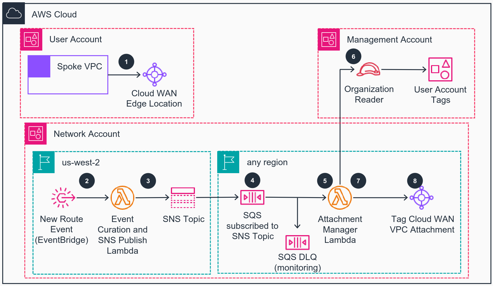

# Guidance for AWS Cloud WAN Attachment Management on AWS

This Guidance builds an augmented approach of managing [AWS Cloud WAN](https://aws.amazon.com/cloud-wan/) segments, in a secure, scalable, and on-demand way. When your organization grows the number of AWS accounts and regions in use, this results in increased operational and security complexities related with admitting new user [Amazon Virtual Private Clouds (VPCs)](https://aws.amazon.com/vpc/) to the network - from performing the correct association to the correct segments, to continually ensuring adherence to the global IP addressing plan. This solution enforces the correct network segment membership, including IP address plan adherence, and allows for central infrastructure teams to overwrite the solution behaviour through tagging configuration when needed.


## Table of Content

1. [Overview](#overview)
    - [Cost](#cost)
2. [Prerequisites](#prerequisites)
    - [Operating System](#operating-system)
    - [AWS account requirements](#aws-account-requirements)
3. [Deployment Steps](#deployment-steps)
4. [Deployment Validation](#deployment-validation)
5. [Running the Guidance](#running-the-guidance)
6. [Next Steps](#next-steps)
7. [Cleanup](#cleanup)

***Optional***

8. [FAQ, known issues, additional considerations, and limitations](#faq-known-issues-additional-considerations-and-limitations)
9. [Revisions](#revisions)
10. [Notices](#notices)
11. [Authors](#authors)

## Overview

AWS Cloud WAN natively supports the use of tags in the Core network attachment, which can be used to specify the desired network segment. In some cases, additional capabilities are required over and above those offered by a tag to segment mapping - such as supporting on-demand VPC creation and attachment, which raises two considerations:

- The user account should not be able to express an opinion, in a form of a tag, as to which network segment it should belong (e.g. test account associating to the production segment). Using the existing mechanism of tag to segment association, we want to ensure
the tagging of the attachment can only be performed from the network account, using network control plane events in a fully automated way;
- In cases where the use of [Amazon VPC IP Address Manager (IPAM)](https://docs.aws.amazon.com/vpc/latest/ipam/what-it-is-ipam.html), is not being enforced, there is a risk of introducing routing black-holes and duplicated addressing in the global network by allowing incorrectly addressed VPCs;

This solution consists of an event-based architecture, working at the control plane of the Core network, through the processing of [AWS Network Manager](https://docs.aws.amazon.com/vpc/?icmpid=docs_homepage_featuredsvcs#aws-network-manager) events. This solution provides a scalable, secure and flexible way of providing on-demand VPC admission to the Core-network, with the following properties, features and use-cases:

- This solution acts within the boundaries of an AWS Network Account, processing control plane events and not exposing any of its components to user accounts. Components of this solution are not exposed outside of the AWS Network Account;
- From the AWS user account perspective, the experience with attaching a VPC to the Core network should be as simple as only creating the attachment with a previously shared AWS Cloud WAN Core network;
- No AWS User Account should be able to express opinions of network association intent, in the form of attachment tags;
- VPC attachment enrollment should be streamlined and done automatically for any VPC which meets evaluation requirements (i.e. attachments are performed against the appropriate segment, IP addressing is coherent);
- If a VPC attachment doesn't meet evaluation requirements, even after successful admission to the Core network it should be evicted (e.g. new CIDR is added to the VPC, which overlaps with the addressing of other VPCs);
- Easily overwrite the behavior of the solution under controlled circumstances (e.g. changes performed by the central infrastructure team);
- Ability to extend further logic and functionality to the original solution;


The architecture of the solution can be seen in the below diagram, followed by the explanation of key events.




1. In an User Account, a Spoke VPC is attached to a shared Cloud WAN edge location. By default, the attachment is moved to a quarantine segment.
2. Once the Spoke VPC CIDR ranges are learned, a Topology Change / New Route event is generated by Network Manager and caught by [Amazon EventBridge](https://aws.amazon.com/eventbridge/), which sends it to a [AWS Lambda](https://aws.amazon.com/pm/lambda/) function for curation.
3. The Lambda function parses the event and publishes it to an [Amazon Simple Notification Service (SNS)](https://aws.amazon.com/sns/) topic with enriched attributes.
4. From other regions, an [Amazon Simple Queue Service (SQS)](https://aws.amazon.com/sqs/) queue is subscribed to the SNS Topic and filters events of interest based on the message attributes. A Dead Letter Queue (DLQ) is also configured for monitoring and troubleshooting.
5. The Attachment Manager Lambda function reads events from the SQS queue to perform the attachment admission to the network.
6. It assumes a role in the Management Account which is used to read the [Tags](https://docs.aws.amazon.com/organizations/latest/userguide/orgs_tagging.html) of the User Account which created the VPC Attachment to Cloud WAN. A ```route-domain``` tag will identify the network segment the account belongs (e.g. production, testing, development, etc).
7. In case the IP Addressing plan of the global network has been packaged with the Attachment Manager Lambda function, the New Route being advertised is also verified for adherence with the IP Addressing plan.
8. If the evaluation logic is successful, the Lambda function will then tag the Spoke VPC attachment with the correct tag, to ensure it is admitted to the correct segment. Otherwise, the attachment will be deleted.


### Cost (TODO)

This section is for a high-level cost estimate. Think of a likely straightforward scenario with reasonable assumptions based on the problem the Guidance is trying to solve. If applicable, provide an in-depth cost breakdown table in this section.

Start this section with the following boilerplate text:

_You are responsible for the cost of the AWS services used while running this Guidance. As of <month> <year>, the cost for running this Guidance with the default settings in the <Default AWS Region (Most likely will be US East (N. Virginia)) > is approximately $<n.nn> per month for processing ( <nnnnn> records )._

Replace this amount with the approximate cost for running your Guidance in the default Region. This estimate should be per month and for processing/serving resonable number of requests/entities.

Suggest you keep this boilerplate text:
_We recommend creating a [Budget](https://docs.aws.amazon.com/cost-management/latest/userguide/budgets-managing-costs.html) through [AWS Cost Explorer](https://aws.amazon.com/aws-cost-management/aws-cost-explorer/) to help manage costs. Prices are subject to change. For full details, refer to the pricing webpage for each AWS service used in this Guidance._

The following table provides a sample cost breakdown for deploying this Guidance with the default parameters in the US East (N. Virginia) Region for one month.

| AWS service  | Dimensions | Cost [USD] |
| ----------- | ------------ | ------------ |
| Amazon API Gateway | 1,000,000 REST API calls per month  | $ 3.50month |
| Amazon Cognito | 1,000 active users per month without advanced security feature | $ 0.00 |


## Prerequisites

### Operating System

- Talk about the base Operating System (OS) and environment that can be used to run or deploy this Guidance, such as *Mac, Linux, or Windows*. Include all installable packages or modules required for the deployment. 
- By default, assume Amazon Linux 2/Amazon Linux 2023 AMI as the base environment. All packages that are not available by default in AMI must be listed out.  Include the specific version number of the package or module.

**Example:**
“These deployment instructions are optimized to best work on **<Amazon Linux 2 AMI>**.  Deployment in another OS may require additional steps.”

- Include install commands for packages, if applicable.


### AWS account requirements

The following AWS account pre-requisites should be ensured:

1. Modify the AWS Cloud WAN Core network policy (i.e. segments and association method);
2. Create a [Service Control Policy (SCP)](https://docs.aws.amazon.com/organizations/latest/userguide/orgs_manage_policies_scps.html) to prevent user accounts from using the segment association tag;
3. Create an [AWS Identity and Access Management (IAM)](https://aws.amazon.com/iam/) role in the AWS Management Account which allows the querying of AWS Account Tags from the Central Network account;
4. User accounts are tagged with the appropriate route segment / domain tag, as part of the account vending process;

Let's go over each of them, one by one.

#### 1. Modify the AWS Cloud WAN Core network policy (i.e. segments and association method)

First, you need to have a running AWS Cloud WAN Core network with a few pre-requisites configured, including event monitoring. A policy requires one or more segments. In a typical environment, you might have:

- Your business specific segments, e.g. production, staging, testing, wan, infrastructure, etc
- A last-hop return segment containing all destination routes, i.e. every attachment propagation - normally aggregating your east-west inspection VPCs (let’s call it the ```fullreturn``` segment).

Additionally, as part of this solution, you will need to have extra segments, the ```quarantine``` and ```quarantineroutes```:

- ```quarantine``` segment: Into which any untagged segment will be associated; this prevents any kind of communication
- ```quarantineroutes``` segment: Which will be used to learn any routes being propagated from the quarantine VPC segments


The following code snippet shows the declaration of these segments as part of the Cloud WAN Network Policy document.


```
{
  "version": "2021.12",
  "segments": [
    {
      "isolate-attachments": true,
      "name": "quarantine",
      "require-attachment-acceptance": false
    },
    {
      "isolate-attachments": true,
      "name": "quarantineroutes",
      "require-attachment-acceptance": false
    },
    ...
  ],
  "segment-actions": [
    {
      "action": "share",
      "mode": "attachment-route",
      "segment": "quarantine",
      "share-with": [ "quarantineroutes" ]
    },
    ...
  ],
  ...
}
```

The next pre-requisite in the Cloud WAN network policy will be specifying the association method. This will only contain two attachment policies to manage the admission of attachments to the correct segments:

- Most preferred policy, where the route-domain tag value will be used to select the segment for the attachment to be associated with;
- Least preferred policy, where in the absence of the route-domain tag, attachments will be associated with the quarantine segment;

The following code snippet shows the declaration of the association method in the Cloud WAN Network Policy document.


```
{
  ...
  "attachment-policies": [
    {
      "action": {
        "association-method": "tag",
        "tag-value-of-key": "route-domain"
      },
      "conditions": [
        { "type": "any" }
      ],
      "rule-number": 10
    },
    {
      "action": {
        "association-method": "constant",
        "segment": "quarantine"
      },
      "conditions": [
        { "type": "any" }
      ],
      "rule-number": 20
    }
  ],
  ...
}
```


#### 2. Create a Service Control Policy (SCP) to prevent user accounts from using the segment association tag

The next pre-requisite is to make sure that principals in the AWS User account cannot use the route-domain tag when interacting with the Cloud WAN Core network attachment. Users should be prevented from specifying segment membership metadata. The following SCP example can be used to enforce this pre-requisite and should be applied within the AWS Management Account and for every Organization Unit which is not centrally managed by the infrastructure team


```
{
  "Version": "2012-10-17",
  "Statement": [
    {
      "Sid": "DenyAttachmentTags1",
      "Effect": "Deny",
      "Action": [
        "networkmanager:TagResource",
        "networkmanager:CreateVpcAttachment"
      ],
      "Resource": "arn:aws:networkmanager:*",
      "Condition": {
        "ForAllValues:StringEquals": { "aws:TagKeys": [ "route-domain" ] }
      }
    }
  ]
}

```


#### 3. Create an AWS Identity and Access Management (IAM) role in the AWS Management Account which allows the querying of AWS Account Tags from the Central Network account


#### 4. User accounts are tagged with the appropriate route segment / domain tag, as part of the account vending process


*List out pre-requisites required on the AWS account if applicable, this includes enabling AWS regions, requiring ACM certificate.*

**Example:** “This deployment requires you have public ACM certificate available in your AWS account”

**Example resources:**
- ACM certificate 
- DNS record
- S3 bucket
- VPC
- IAM role with specific permissions
- Enabling a Region or service etc.


### aws cdk bootstrap (if sample code has aws-cdk)

<If using aws-cdk, include steps for account bootstrap for new cdk users.>

**Example blurb:** “This Guidance uses aws-cdk. If you are using aws-cdk for first time, please perform the below bootstrapping....”

### Service limits  (if applicable)

<Talk about any critical service limits that affect the regular functioning of the Guidance. If the Guidance requires service limit increase, include the service name, limit name and link to the service quotas page.>

### Supported Regions (if applicable)

<If the Guidance is built for specific AWS Regions, or if the services used in the Guidance do not support all Regions, please specify the Region this Guidance is best suited for>


## Deployment Steps

Deployment steps must be numbered, comprehensive, and usable to customers at any level of AWS expertise. The steps must include the precise commands to run, and describe the action it performs.

* All steps must be numbered.
* If the step requires manual actions from the AWS console, include a screenshot if possible.
* The steps must start with the following command to clone the repo. ```git clone xxxxxxx```
* If applicable, provide instructions to create the Python virtual environment, and installing the packages using ```requirement.txt```.
* If applicable, provide instructions to capture the deployed resource ARN or ID using the CLI command (recommended), or console action.

 
**Example:**

1. Clone the repo using command ```git clone xxxxxxxxxx```
2. cd to the repo folder ```cd <repo-name>```
3. Install packages in requirements using command ```pip install requirement.txt```
4. Edit content of **file-name** and replace **s3-bucket** with the bucket name in your account.
5. Run this command to deploy the stack ```cdk deploy``` 
6. Capture the domain name created by running this CLI command ```aws apigateway ............```


## Deployment Validation

<Provide steps to validate a successful deployment, such as terminal output, verifying that the resource is created, status of the CloudFormation template, etc.>


**Examples:**

* Open CloudFormation console and verify the status of the template with the name starting with xxxxxx.
* If deployment is successful, you should see an active database instance with the name starting with <xxxxx> in        the RDS console.
*  Run the following CLI command to validate the deployment: ```aws cloudformation describe xxxxxxxxxxxxx```


## Running the Guidance

<Provide instructions to run the Guidance with the sample data or input provided, and interpret the output received.> 

This section should include:

* Guidance inputs
* Commands to run
* Expected output (provide screenshot if possible)
* Output description


## Next Steps

Provide suggestions and recommendations about how customers can modify the parameters and the components of the Guidance to further enhance it according to their requirements.


## Cleanup

- Include detailed instructions, commands, and console actions to delete the deployed Guidance.
- If the Guidance requires manual deletion of resources, such as the content of an S3 bucket, please specify.


## Notices

*Customers are responsible for making their own independent assessment of the information in this Guidance. This Guidance: (a) is for informational purposes only, (b) represents AWS current product offerings and practices, which are subject to change without notice, and (c) does not create any commitments or assurances from AWS and its affiliates, suppliers or licensors. AWS products or services are provided “as is” without warranties, representations, or conditions of any kind, whether express or implied. AWS responsibilities and liabilities to its customers are controlled by AWS agreements, and this Guidance is not part of, nor does it modify, any agreement between AWS and its customers.*


## License

This library is licensed under the MIT-0 License. See the [LICENSE](LICENSE) file.


## Contributing

See [CONTRIBUTING](CONTRIBUTING.md) for more information.


## Authors

- João Rodrigues, Senior Cloud Infrastructure Architect, AWS
- Srivalsan Mannoor Sudhagar, Cloud Infrastructure Architect, AWS
