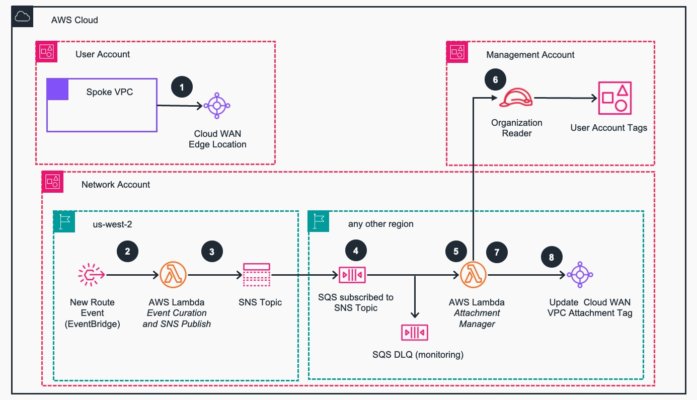

# Guidance for Attachment Management to  AWS Cloud WAN

This Guidance builds an augmented approach of managing [AWS Cloud WAN](https://aws.amazon.com/cloud-wan/) segments, in a secure, scalable, and on-demand way. When your organization grows the number of AWS accounts and regions in use, this results in increased operational and security complexities related with admitting new user [Amazon Virtual Private Clouds (VPCs)](https://aws.amazon.com/vpc/) to the network - from performing the correct association to the correct segments, to continually ensuring adherence to the global IP addressing plan. This solution enforces the correct network segment membership, including IP address plan adherence, and allows for central infrastructure teams to overwrite the solution behaviour through tagging configuration when needed.


## Table of Content

1. [Overview](#overview)
    - [Architecture](#architecture)
    - [Cost](#cost)
3. [Prerequisites](#prerequisites)
    - [Operating System](#operating-system)
    - [AWS account requirements](#aws-account-requirements)
4. [Deployment Steps](#deployment-steps)
5. [Deployment Validation](#deployment-validation)
6. [Running the Guidance](#running-the-guidance)
7. [Cleanup](#cleanup)
8. [Notices](#notices)
9. [Contributing](#contributing)
10. [Authors](#authors)


## Overview

AWS Cloud WAN natively supports the use of tags in the Core network attachment, which can be used to specify the desired network segment. In some cases, additional capabilities are required over and above those offered by a tag to segment mapping - such as supporting on-demand VPC creation and attachment, which raises two considerations:

- The user account should not be able to express an opinion, in a form of a tag, as to which network segment it should belong (e.g. test account associating to the production segment). Using the existing mechanism of tag to segment association, we want to ensure
the tagging of the attachment can only be performed from the network account, using network control plane events in a fully automated way;
- In cases where the use of [Amazon VPC IP Address Manager (IPAM)](https://docs.aws.amazon.com/vpc/latest/ipam/what-it-is-ipam.html), is not being enforced, there is a risk of introducing routing black-holes and duplicated addressing in the global network by allowing incorrectly addressed VPCs;

This solution consists of an event-based architecture, working at the control plane of the Core network, through the processing of [AWS Network Manager](https://docs.aws.amazon.com/vpc/?icmpid=docs_homepage_featuredsvcs#aws-network-manager) events. This solution provides a scalable, secure and flexible way of providing on-demand VPC admission to the Core-network, with the following properties, features and use-cases:

- This solution acts within the boundaries of an AWS Network Account, processing control plane events and not exposing any of its components to user accounts. Components of this solution are not exposed outside of the AWS Network Account;
- From the AWS user account perspective, the experience with attaching a VPC to the Core network should be as simple as only creating the attachment with a previously shared AWS Cloud WAN Core network;
- No AWS User Account should be able to express opinions of network association intent, in the form of attachment tags;
- VPC attachment enrollment should be streamlined and done automatically for any VPC which meets evaluation requirements (i.e. attachments are performed against the appropriate segment, IP addressing is coherent);
- If a VPC attachment doesn't meet evaluation requirements, even after successful admission to the Core network it should be evicted (e.g. new CIDR is added to the VPC, which overlaps with the addressing of other VPCs);
- Easily overwrite the behavior of the solution under controlled circumstances (e.g. changes performed by the central infrastructure team);
- Ability to extend further logic and functionality to the original solution;

### Architecture
The architecture of the solution can be seen in the below diagram, followed by the explanation of key events.




1. In an User Account, a Spoke VPC is attached to a shared Cloud WAN edge location. By default, the attachment is moved to a quarantine segment.
2. Once the Spoke VPC CIDR ranges are learned, a Topology Change / New Route event is generated by Network Manager and caught by [Amazon EventBridge](https://aws.amazon.com/eventbridge/), which sends it to a [AWS Lambda](https://aws.amazon.com/pm/lambda/) function for curation.
3. The Lambda function parses the event and publishes it to an [Amazon Simple Notification Service (SNS)](https://aws.amazon.com/sns/) topic with enriched attributes.
4. From other regions, an [Amazon Simple Queue Service (SQS)](https://aws.amazon.com/sqs/) queue is subscribed to the SNS Topic and filters events of interest based on the message attributes. A Dead Letter Queue (DLQ) is also configured for monitoring and troubleshooting.
5. The Attachment Manager Lambda function reads events from the SQS queue to perform the attachment admission to the network.
6. It assumes a role in the Management Account which is used to read the [Tags](https://docs.aws.amazon.com/organizations/latest/userguide/orgs_tagging.html) of the User Account which created the VPC Attachment to Cloud WAN. A ```route-domain``` tag will identify the network segment the account belongs (e.g. production, testing, development, etc).
7. In case the IP Addressing plan of the global network has been packaged with the Attachment Manager Lambda function, the New Route being advertised is also verified for adherence with the IP Addressing plan.
8. If the evaluation logic is successful, the Lambda function will then tag the Spoke VPC attachment with the correct tag, to ensure it is admitted to the correct segment. Otherwise, the attachment will be deleted.


Optionally we can also enforce IP Address planning coherence for specific regions and segments. The following code snippet shows a YAML example for the definition of the VPC Segment Network map (i.e. file ```vpc_segment_address_map.yml``` in the lambda function folder), describing a list of accepted IP Address ranges defined per segment and region. This configuration will be in a file which is packaged with the lambda function that performs the segment admission controls (this file should be generated of copied into the lambda source code function as part of the CI/CD job). To completely disable the checks you can keep the file empty with {} (i.e. empty dictionary syntax in YAML).

```
infrastructure:
  eu-central-1:
    - "IP ADDRESS SUMMARIES ACCEPTABLE FOR THE SEGMENT AND REGION..."
  ap-southeast-1:
    - "IP ADDRESS SUMMARIES ACCEPTABLE FOR THE SEGMENT AND REGION..."

dev:
  eu-central-1:
    - "IP ADDRESS SUMMARIES ACCEPTABLE FOR THE SEGMENT AND REGION..."
  ap-southeast-1:
    - "IP ADDRESS SUMMARIES ACCEPTABLE FOR THE SEGMENT AND REGION..."

staging:
  eu-central-1:
    - "IP ADDRESS SUMMARIES ACCEPTABLE FOR THE SEGMENT AND REGION..."
  ap-southeast-1:
    - "IP ADDRESS SUMMARIES ACCEPTABLE FOR THE SEGMENT AND REGION..."

prod:
  eu-central-1:
    - "IP ADDRESS SUMMARIES ACCEPTABLE FOR THE SEGMENT AND REGION..."
  ap-southeast-1:
    - "IP ADDRESS SUMMARIES ACCEPTABLE FOR THE SEGMENT AND REGION..."
```

### AWS Services used  in this Guidance

| **AWS service**  | Role | Description |
|-----------|------------|------------|
|[Amazon Cloud WAN](https://aws.amazon.com/cloud-wan/)| Core service | Networking Edge location and VPC attachment tag|
|[AWS Lambda](https://aws.amazon.com/lambda/) | Core service| Processes security log events in CloudWatch logs to package them into ASFF format for Security Hub |
| [Amazon Simple Queue Service (Amazon SQS)](https://aws.amazon.com/sqs/) | Core service| Used as an event processor and also need to govern scale-out. |
| [Amazon Simple Notification Service (Amazon SNS)](https://aws.amazon.com/sns) | Core service| Provides topic for an atttachment event message and further processing  |

### Cost

You are responsible for the cost of the AWS services used while running this Guidance. As of June 2024, the cost for running this Guidance with  AWS Region  US East (N. Virginia) is approximately $ 1788.52 per month for processing (1000 records per month).

The following table provides a sample cost breakdown for deploying this Guidance with the default parameters in the US East (N. Virginia) Region for one month.

| AWS service  | Dimensions | Cost [USD] |
| ----------- | ------------ | ------------ |
| [Amazon Cloud WAN](https://aws.amazon.com/cloud-wan/) | 20 attachments per region & 10 Transit Gateway peering connections  | $ 1,788.52  per month |
| [AWS Lambda](https://aws.amazon.com/lambda/) | 1,000 active requests per month  | $ 0.00 |
| [Amazon Simple Queue Service (Amazon SQS)](https://aws.amazon.com/sqs/)| 1,000 active requests per month  | $ 0.00 |
| [Amazon Simple Notification Service (Amazon SNS)](https://aws.amazon.com/sns) | 1,000 active requests per month  | $ 0.00 |

We recommend creating a [Budget](https://docs.aws.amazon.com/cost-management/latest/userguide/budgets-managing-costs.html) through [AWS Cost Explorer](https://aws.amazon.com/aws-cost-management/aws-cost-explorer/) to help manage costs. Prices are subject to change. For full details, refer to the pricing webpage for each AWS service used in this Guidance

## Prerequisites

### Operating System

The deployment method for this guide was tested on an Ubuntu 22.04 Operating System. It should run on any new and supported version of Mac OS X, Linux or Windows, assuming you can install the required packages.

In this guide we cover launching the solution using [CloudFormation](https://aws.amazon.com/cloudformation/) and [AWS Serverless Application Model (SAM)](https://aws.amazon.com/serverless/sam/) to do the packaging and pushing the lambdas. The easiest way to install SAM is through [brew](https://brew.sh/). Here's how you could setup your environment on an Ubuntu 22.04 host.

```
# Update and install basic tools
apt update && apt upgrade -y
apt install -y build-essential procps curl file git

# Install brew
/bin/bash -c "$(curl -fsSL https://raw.githubusercontent.com/Homebrew/install/HEAD/install.sh)"
echo 'eval "$(/home/linuxbrew/.linuxbrew/bin/brew shellenv)"' >> ~/.bashrc
eval "$(/home/linuxbrew/.linuxbrew/bin/brew shellenv)"

# Install AWS CLI and SAM
brew install aws-sam-cli awscli
```


[Terraform](https://www.terraform.io/) (or [OpenTofu](https://opentofu.org/)) and [Cloud Development Kit for Terraform (CDK-TF)](https://developer.hashicorp.com/terraform/cdktf) implementations are also available in this repository, but will not be covered in this example.


### AWS account requirements

The following AWS account pre-requisites should be ensured:

1. Modify the AWS Cloud WAN Core network policy (i.e. segments and association method);
2. Create a [Service Control Policy (SCP)](https://docs.aws.amazon.com/organizations/latest/userguide/orgs_manage_policies_scps.html) to prevent user accounts from using the segment association tag;
3. Create an [AWS Identity and Access Management (IAM)](https://aws.amazon.com/iam/) role in the AWS Management Account which allows the querying of AWS Account Tags from the Central Network account;
4. User accounts are tagged with the appropriate route segment / domain tag, as part of the account vending process;

Let's go over each of them, one by one.

#### 1. Modify the AWS Cloud WAN Core network policy (i.e. segments and association method)

First, you need to have a running AWS Cloud WAN Core network with a few pre-requisites configured, including event monitoring. A policy requires one or more segments. In a typical environment, you might have:

- Your business specific segments, e.g. production, staging, testing, wan, infrastructure, etc
- A last-hop return segment containing all destination routes, i.e. every attachment propagation - normally aggregating your east-west inspection VPCs (let’s call it the ```fullreturn``` segment).

Additionally, as part of this solution, you will need to have extra segments, the ```quarantine``` and ```quarantineroutes```:

- ```quarantine``` segment: Into which any untagged segment will be associated; this prevents any kind of communication
- ```quarantineroutes``` segment: Which will be used to learn any routes being propagated from the quarantine VPC segments


The following code snippet shows the declaration of these segments as part of the Cloud WAN Network Policy document.


```
{
  "version": "2021.12",
  "segments": [
    {
      "isolate-attachments": true,
      "name": "quarantine",
      "require-attachment-acceptance": false
    },
    {
      "isolate-attachments": true,
      "name": "quarantineroutes",
      "require-attachment-acceptance": false
    },
    ...
  ],
  "segment-actions": [
    {
      "action": "share",
      "mode": "attachment-route",
      "segment": "quarantine",
      "share-with": [ "quarantineroutes" ]
    },
    ...
  ],
  ...
}
```

The next pre-requisite in the Cloud WAN network policy will be specifying the association method. This will only contain two attachment policies to manage the admission of attachments to the correct segments:

- Most preferred policy, where the route-domain tag value will be used to select the segment for the attachment to be associated with;
- Least preferred policy, where in the absence of the route-domain tag, attachments will be associated with the quarantine segment;

The following code snippet shows the declaration of the association method in the Cloud WAN Network Policy document.


```
{
  ...
  "attachment-policies": [
    {
      "action": {
        "association-method": "tag",
        "tag-value-of-key": "route-domain"
      },
      "conditions": [
        { "type": "any" }
      ],
      "rule-number": 10
    },
    {
      "action": {
        "association-method": "constant",
        "segment": "quarantine"
      },
      "conditions": [
        { "type": "any" }
      ],
      "rule-number": 20
    }
  ],
  ...
}
```


#### 2. Create a Service Control Policy (SCP) to prevent user accounts from using the segment association tag

The next pre-requisite is to make sure that principals in the AWS User account cannot use the ```route-domain``` tag when interacting with the Cloud WAN Core network attachment. Users should be prevented from specifying segment membership metadata. The following SCP example can be used to enforce this pre-requisite and should be applied within the AWS Management Account and for every Organization Unit which is not centrally managed by the infrastructure team


```
{
  "Version": "2012-10-17",
  "Statement": [
    {
      "Sid": "DenyAttachmentTags1",
      "Effect": "Deny",
      "Action": [
        "networkmanager:TagResource",
        "networkmanager:CreateVpcAttachment"
      ],
      "Resource": "arn:aws:networkmanager:*",
      "Condition": {
        "ForAllValues:StringEquals": { "aws:TagKeys": [ "route-domain" ] }
      }
    }
  ]
}
```

Note: Depending on the Infrastructure as Code (IaC) tool you are using, your users may need to mark the tag configuration of the network attachments to be ignored (e.g. if using Terraform you will need to use a ```lifecycle``` statement) to prevent attempts of tag overwrite and API errors due to the SCP.


#### 3. Create an AWS Identity and Access Management (IAM) role in the AWS Management Account which allows the querying of AWS Account Tags from the Central Network account

The next pre-requisite, is to have an IAM role deployed in the AWS Management account which your Network Account can assume. This role will only allow you to query AWS Account Tags in the [AWS Organizations](https://aws.amazon.com/organizations/) API for the solution to discover the target segment for VPCs created within the account.

Here's an example of the Trust Policy:

```
{
  "Version": "2012-10-17",
  "Statement": [
    {
      "Sid": "",
      "Effect": "Allow",
      "Principal": {s
        "AWS": "arn:aws:iam::$NETWORK_ACCOUNT_ID:root"
      },
      "Action": [
        "sts:AssumeRole",
        "sts:TagSession"
      ]
    }
  ]
}
```

And here are the permissions for this role:


```
{
  "Version": "2012-10-17",
  "Statement": [
    {
      "Action": [
        "organizations:Describe*",
        "organizations:List*"
      ],
      "Effect": "Allow",
      "Resource": "*",
      "Sid": "DescribeOrgAccounts"
    }
  ]
}
```


#### 4. User accounts are tagged with the appropriate route segment / domain tag, as part of the account vending process

Finally, you need to ensure that your user accounts are tagged with the appropriate ```route-domain``` tag as part of the account vending process (for example: Production accounts would have a ```route-domain: production``` tag, matching an existing ```production``` segment)


### Supported Regions (if applicable)

This solution is composed of two types of stacks, with the following regional requirements:

* Network Manager Event Processor Stack: needs to be deployed in Oregon Region (us-west-2);
* Attachment Manager Stacks: can be deployed on any region.


## Deployment Steps

1. Deploy the 'Network Manager Event Processor' stack:


```
cd source/network-manager-events/cloudformation/

# Build the lambda and deploy the cloudformation stack
sam build && sam deploy \
  --resolve-s3 \
  --capabilities CAPABILITY_IAM CAPABILITY_NAMED_IAM CAPABILITY_AUTO_EXPAND \
  --stack-name network-manager-events \
  --region us-west-2 \
  --parameter-overrides \
      ParameterKey=Name,ParameterValue="network-manager-events"

# Let's grab the outputs
NETWORK_MANAGER_STACK_OUTPUT=$(aws cloudformation describe-stacks \
  --stack-name network-manager-events \
  --region us-west-2 \
  --query 'Stacks[0].Outputs')
SNS_TOPIC_ARN=$(echo $NETWORK_MANAGER_STACK_OUTPUT | jq -r '.[] | select(.OutputKey=="SnsNetworkEventsArn") | .OutputValue')

cd -
```


2. Deploy the 'Attachment Manager' stack in the main region (don't forget to populate the variables below):

```
# Set the variables with your correct values
GLOBAL_NETWORK_ID="<insert Network Manager Global Network id here>"
ATTACHMENT_MANAGER_NAME="cloudwan-attachment-manager"
AWS_ACCOUNT_READER_ROLE_ARN="<insert arn of IAM Role to read the account tags (aws pre-requisite 3)>"
CORE_NETWORK_ARN="<insert Cloud WAN Core Network arn here>"
FULL_RETURN_TABLE="fullreturn"


cd source/attachment-manager/cloudformation/

aws cloudformation validate-template \
  --template-body file://template.yml \
  --region $MAIN_AWS_REGION

# Copy the vpc segment address map to be packaged with the lambda
cp vpc_segment_address_map.yml ../lambda/attachment_manager

# Build the lambda and deploy the cloudformation stack
sam build && sam deploy \
  --resolve-s3 \
  --capabilities CAPABILITY_IAM CAPABILITY_NAMED_IAM CAPABILITY_AUTO_EXPAND \
  --stack-name cloudwan-attachment-manager \
  --region $MAIN_AWS_REGION \
  --parameter-overrides \
      ParameterKey=Name,ParameterValue=${ATTACHMENT_MANAGER_NAME} \
      ParameterKey=AwsAccountReaderRoleArn,ParameterValue=${AWS_ACCOUNT_READER_ROLE_ARN} \
      ParameterKey=NetworkEventsSnsTopicArn,ParameterValue=${SNS_TOPIC_ARN} \
      ParameterKey=GlobalNetworkId,ParameterValue=${GLOBAL_NETWORK_ID} \
      ParameterKey=CoreNetworkArn,ParameterValue=${CORE_NETWORK_ARN} \
      ParameterKey=FullReturnTable,ParameterValue=${FULL_RETURN_TABLE}
```


3. Deploy the 'Attachment Manager' stack in the redundant region (optional):

```
sam build && sam deploy \
  --resolve-s3 \
  --capabilities CAPABILITY_IAM CAPABILITY_NAMED_IAM CAPABILITY_AUTO_EXPAND \
  --stack-name cloudwan-attachment-manager-secondary \
  --region $REDUNDANT_AWS_REGION \
  --parameter-overrides \
      ParameterKey=Name,ParameterValue=${ATTACHMENT_MANAGER_NAME} \
      ParameterKey=AwsAccountReaderRoleArn,ParameterValue=${AWS_ACCOUNT_READER_ROLE_ARN} \
      ParameterKey=NetworkEventsSnsTopicArn,ParameterValue=${SNS_TOPIC_ARN} \
      ParameterKey=GlobalNetworkId,ParameterValue=${GLOBAL_NETWORK_ID} \
      ParameterKey=CoreNetworkArn,ParameterValue=${CORE_NETWORK_ARN} \
      ParameterKey=FullReturnTable,ParameterValue=${FULL_RETURN_TABLE} \
      ParameterKey=SqsEventsDelaySeconds,ParameterValue="15"
```


## Deployment Validation


1. Verify the 'Network Manager Event Processor' stack deployment output from the SAM execution:

```
...
Successfully created/updated stack - network-manager-events in us-west-2
```


2. Verify the 'Attachment Manager' stack deployment output from the SAM execution, in the main region:

```
...
Successfully created/updated stack - cloudwan-attachment-manager in eu-west-1
```


3. Verify the 'Attachment Manager' stack deployment output from the SAM execution, in the redundant region (optional):

```
...
Successfully created/updated stack - cloudwan-attachment-manager-secondary in us-east-1
```


## Running the Guidance

Once the Guidance has been deployed , when the user creates a spoke VPC in a user account , you can see that the VPC is automatically associated with the correct segment in the Cloud WAN core network if it adheres to the IP addressing plan. If the spoke VPC created  doesnot adhere the business requirements , it will be automatically associated with quarantine segment which prevents any communication with other networks.   


## Cleanup

To remove the solution, you can execute the following SAM CLI commands:

1. Delete Attachment Manager Stack in the main region

```
sam delete --no-prompts \
  --stack-name cloudwan-attachment-manager \
  --region eu-west-1
```

2. Delete Attachment Manager Stack in the secondary region

```
sam delete --no-prompts \
  --stack-name cloudwan-attachment-manager-secondary \
  --region us-east-1
```

3. Delete the Network Manager Events Stack in us-west-2

```
sam delete --no-prompts \
  --stack-name network-manager-events \
  --region us-west-2
```


To remove the SAM bootstrap, you can go to the console for each of the regions, empty all the relevant buckets from the S3 console, and finally delete the CloudFormation stacks with name aws-sam-cli-managed-default.


## Notices

*Customers are responsible for making their own independent assessment of the information in this Guidance. This Guidance: (a) is for informational purposes only, (b) represents AWS current product offerings and practices, which are subject to change without notice, and (c) does not create any commitments or assurances from AWS and its affiliates, suppliers or licensors. AWS products or services are provided “as is” without warranties, representations, or conditions of any kind, whether express or implied. AWS responsibilities and liabilities to its customers are controlled by AWS agreements, and this Guidance is not part of, nor does it modify, any agreement between AWS and its customers.*


## License

This library is licensed under the MIT-0 License. See the [LICENSE](LICENSE) file.


## Contributing

See [CONTRIBUTING](CONTRIBUTING.md) for more information.


## Authors

- João Rodrigues, Senior Cloud Infrastructure Architect, AWS
- Srivalsan Mannoor Sudhagar, Cloud Infrastructure Architect, AWS
